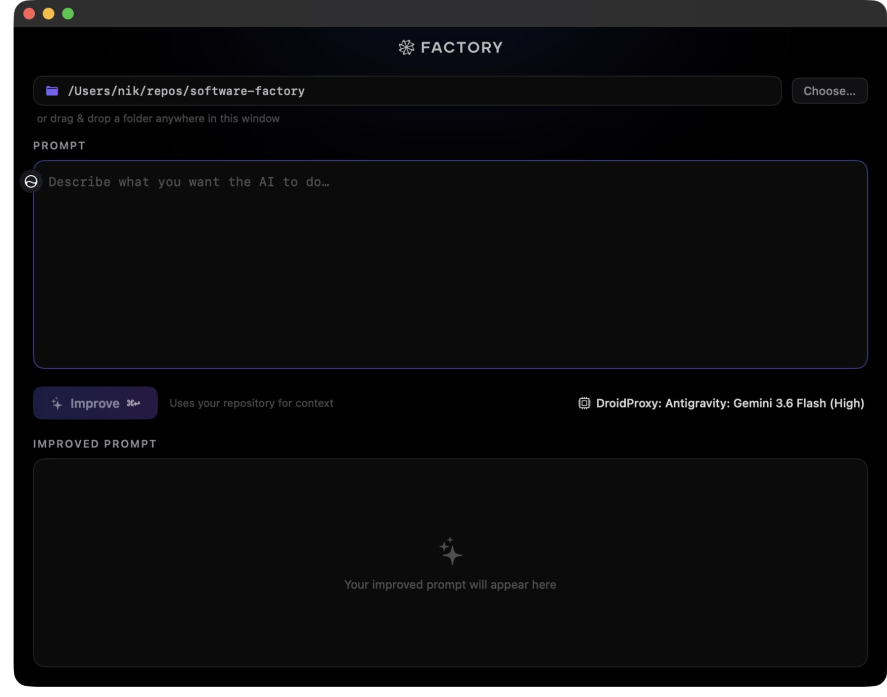

<p align="center">
  <picture>
    <source media="(prefers-color-scheme: dark)" srcset="docs/assets/factory-logo-dark.svg">
    
  </picture>
</p>

<h1 align="center">Prompt Improver</h1>

<p align="center">
  
</p>

<p align="center">
  A native macOS Electron app that turns rough draft prompts into polished,<br>
  repository-grounded prompts using Factory's <a href="https://docs.factory.ai">Droid TypeScript SDK</a> and interactive agent questionnaires.
</p>

<p align="center">
  
</p>

## How it works

1. **Compose**: Enter your draft prompt, choose a local repository (or drag & drop a folder), and select model & reasoning preferences. Press **Improve →** (⌘↩).
2. **Interactive Clarification**: The agent performs a fast read-only scan of the codebase and asks 2–4 targeted questions using the `AskUser` tool to clarify scope, tech stack, and conventions.
3. **Grounded Result**: The agent outputs a final, polished prompt ready to use with an AI coding agent. Easily copy it, use it as a new draft, or inspect earlier answers.

## Features

- **Multi-turn AskUser flow**: Answers clarify ambiguity before the final prompt is generated.
- **Factory OLED design**: Custom dark surfaces (`#020202`), monospace typography, and clean questionnaire cards with keyboard navigation (`1–9`, `Enter`, `↑↓`).
- **Read-only and safe**: Scans repository manifests and structure without modifying any code.
- **Model & reasoning customization**: Supports Default, built-in models (Claude Opus 5, Claude Sonnet 5, GPT-5.3 Codex), and custom models from `~/.factory/settings.json`.
- **Instant cancellation**: Cleanly terminates the agent session and restores your draft.
- **State persistence**: Remembers repository, model, and reasoning effort across sessions.

## Requirements

- **macOS 14+** (Apple Silicon arm64)
- **Node.js 20+ or 22+**
- **[droid CLI](https://docs.factory.ai)** installed and available on your `PATH`
- **Factory API key** (`FACTORY_API_KEY`, or entered in the app prompt)

Prompt Improver authenticates the Droid SDK with a Factory API key. If the app inherits a non-empty `FACTORY_API_KEY` environment variable, it uses that key and does not prompt. Otherwise it asks for a key on launch. An entered key is kept only in memory for the current app run and is never written to preferences.

## Quickstart

```sh
# Clone repository
git clone git@github.com:nikships/prompt-improver.git
cd prompt-improver

# Run setup and launch development app
./Scripts/setup.sh
npm run dev
```

For development you can also pass the key in the environment (use a placeholder, never commit credentials):

```sh
FACTORY_API_KEY=your_key npm run dev
```

## Development Commands

```sh
npm run dev           # Start Electron app in development mode with HMR
npm run build         # Build production main, preload, and renderer bundles
npm run typecheck     # Typecheck TypeScript files
npm run lint          # Run ESLint (zero warnings)
npm run lint:fix      # Auto-fix linting issues
npm test              # Run unit test suite
npm run test:coverage # Run test suite and enforce >80% coverage threshold
npm run package       # Build macOS arm64 DMG and ZIP into dist/
npm run check         # Run typecheck, lint, test, and build
```

## License

MIT
